# Ex.07 Restaurant Website
## Date:21-05-2025

## AIM:
To develop a static Restaurant website to display the food items and services provided by them.

## DESIGN STEPS:

### Step 1:
Requirement collection.

### Step 2:
Creating the layout using HTML and CSS.

### Step 3:
Updating the sample content.

### Step 4:
Choose the appropriate style and color scheme.

### Step 5:
Validate the layout in various browsers.

### Step 6:
Validate the HTML code.

### Step 7:
Publish the website in the given URL.

## PROGRAM:
```
home.html

<!DOCTYPE html>
<html lang="en">
<head>
    <meta charset="UTF-8">
    <meta name="viewport" content="width=device-width, initial-scale=1.0">
    <title>Shreybites | Fine Dining Experience</title>
    <link rel="stylesheet" href="https://cdnjs.cloudflare.com/ajax/libs/font-awesome/6.4.0/css/all.min.css">
    <link rel="preconnect" href="https://fonts.googleapis.com">
    <link rel="preconnect" href="https://fonts.gstatic.com" crossorigin>
    <link href="https://fonts.googleapis.com/css2?family=Playfair+Display:wght@400;500;600;700&family=Poppins:wght@300;400;500;600&display=swap" rel="stylesheet">
    <link rel="icon" href="favicon.ico" type="image/x-icon">
    <style>
        :root {
            --primary: #2a5c45;
            --secondary: #d4a762;
            --light: #f8f9fa;
            --dark: #212529;
            --accent: #e63946;
            --text: #333333;
            --bg-light: #f5f5f5;
        }
        
        * {
            margin: 0;
            padding: 0;
            box-sizing: border-box;
        }
        
        body {
            font-family: 'Poppins', sans-serif;
            color: var(--text);
            background-color: var(--bg-light);
            line-height: 1.6;
        }
        
        h1, h2, h3, h4 {
            font-family: 'Playfair Display', serif;
            font-weight: 600;
        }
        
        header {
            background: linear-gradient(rgba(0, 0, 0, 0.7), rgba(0, 0, 0, 0.7)), url('https://images.unsplash.com/photo-1517248135467-4c7edcad34c4?ixlib=rb-4.0.3&ixid=M3wxMjA3fDB8MHxwaG90by1wYWdlfHx8fGVufDB8fHx8fA%3D%3D&auto=format&fit=crop&w=1470&q=80') no-repeat center center/cover;
            color: white;
            text-align: center;
            padding: 100px 20px;
            position: relative;
        }
        
        header h1 {
            font-size: 3.5rem;
            margin-bottom: 20px;
            letter-spacing: 1px;
        }
        
        header p {
            font-size: 1.2rem;
            max-width: 700px;
            margin: 0 auto;
            font-weight: 300;
        }
        
        nav {
            background-color: var(--primary);
            position: sticky;
            top: 0;
            z-index: 100;
            box-shadow: 0 2px 10px rgba(0, 0, 0, 0.1);
        }
        
        nav ul {
            list-style: none;
            display: flex;
            justify-content: center;
            margin: 0;
            padding: 15px 0;
        }
        
        nav ul li {
            margin: 0 25px;
            position: relative;
        }
        
        nav ul li a {
            text-decoration: none;
            color: white;
            font-weight: 500;
            font-size: 1.1rem;
            letter-spacing: 0.5px;
            transition: all 0.3s ease;
            padding: 5px 0;
        }
        
        nav ul li a:hover {
            color: var(--secondary);
        }
        
        nav ul li a::after {
            content: '';
            position: absolute;
            width: 0;
            height: 2px;
            background: var(--secondary);
            bottom: 0;
            left: 0;
            transition: width 0.3s ease;
        }
        
        nav ul li a:hover::after {
            width: 100%;
        }
        
        main {
            padding: 40px 20px;
            max-width: 1200px;
            margin: 0 auto;
        }
        
        .hero {
            background: linear-gradient(rgba(0, 0, 0, 0.5), rgba(0, 0, 0, 0.5)), url('https://images.unsplash.com/photo-1414235077428-338989a2e8c0?ixlib=rb-4.0.3&ixid=M3wxMjA3fDB8MHxwaG90by1wYWdlfHx8fGVufDB8fHx8fA%3D%3D&auto=format&fit=crop&w=1470&q=80') no-repeat center center/cover;
            color: white;
            padding: 80px 40px;
            border-radius: 8px;
            margin-bottom: 60px;
            text-align: center;
            position: relative;
        }
        
        .hero h2 {
            font-size: 2.8rem;
            margin-bottom: 20px;
        }
        
        .hero p {
            font-size: 1.2rem;
            max-width: 700px;
            margin: 0 auto 30px;
        }
        
        .cta-buttons {
            display: flex;
            justify-content: center;
            gap: 20px;
            flex-wrap: wrap;
        }
        
        .btn {
            display: inline-block;
            padding: 12px 30px;
            color: white;
            background-color: var(--secondary);
            border-radius: 30px;
            text-decoration: none;
            font-weight: 600;
            transition: all 0.3s ease;
            border: 2px solid var(--secondary);
            text-transform: uppercase;
            letter-spacing: 1px;
            font-size: 0.9rem;
        }
        
        .btn:hover {
            background-color: transparent;
            color: white;
            transform: translateY(-3px);
            box-shadow: 0 5px 15px rgba(0, 0, 0, 0.2);
        }
        
        .btn-outline {
            background-color: transparent;
            border: 2px solid white;
        }
        
        .btn-outline:hover {
            background-color: white;
            color: var(--primary);
        }
        
        .section-title {
            text-align: center;
            margin-bottom: 50px;
            position: relative;
        }
        
        .section-title h2 {
            font-size: 2.5rem;
            color: var(--primary);
            display: inline-block;
            padding-bottom: 15px;
        }
        
        .section-title h2::after {
            content: '';
            position: absolute;
            width: 80px;
            height: 3px;
            background-color: var(--secondary);
            bottom: 0;
            left: 50%;
            transform: translateX(-50%);
        }
        
        .featured-container {
            display: grid;
            grid-template-columns: repeat(auto-fit, minmax(300px, 1fr));
            gap: 30px;
            margin-bottom: 60px;
        }
        
        .featured-item {
            background-color: white;
            border-radius: 8px;
            overflow: hidden;
            box-shadow: 0 5px 15px rgba(0, 0, 0, 0.1);
            transition: all 0.3s ease;
        }
        
        .featured-item:hover {
            transform: translateY(-10px);
            box-shadow: 0 15px 30px rgba(0, 0, 0, 0.15);
        }
        
        .featured-img {
            height: 250px;
            overflow: hidden;
        }
        
        .featured-img img {
            width: 100%;
            height: 100%;
            object-fit: cover;
            transition: transform 0.5s ease;
        }
        
        .featured-item:hover .featured-img img {
            transform: scale(1.1);
        }
        
        .featured-content {
            padding: 25px;
            text-align: center;
        }
        
        .featured-content h3 {
            font-size: 1.5rem;
            margin-bottom: 10px;
            color: var(--primary);
        }
        
        .featured-content p {
            margin-bottom: 15px;
            color: #666;
        }
        
        .price {
            font-weight: 700;
            color: var(--secondary);
            font-size: 1.2rem;
        }
        
        .hours-card {
            background-color: white;
            border-radius: 8px;
            padding: 30px;
            box-shadow: 0 5px 15px rgba(0, 0, 0, 0.1);
            text-align: center;
            max-width: 400px;
            margin: 0 auto;
        }
        
        .hours-card h3 {
            font-size: 1.8rem;
            color: var(--primary);
            margin-bottom: 20px;
            position: relative;
            padding-bottom: 15px;
        }
        
        .hours-card h3::after {
            content: '';
            position: absolute;
            width: 50px;
            height: 2px;
            background-color: var(--secondary);
            bottom: 0;
            left: 50%;
            transform: translateX(-50%);
        }
        
        .hours-card p {
            margin: 15px 0;
            font-size: 1.1rem;
        }
        
        .hours-card .highlight {
            color: var(--secondary);
            font-weight: 600;
        }
        
        footer {
            background-color: var(--primary);
            color: white;
            padding: 60px 20px 30px;
            text-align: center;
        }
        
        .footer-content {
            max-width: 1200px;
            margin: 0 auto;
            display: grid;
            grid-template-columns: repeat(auto-fit, minmax(250px, 1fr));
            gap: 40px;
            text-align: left;
            margin-bottom: 40px;
        }
        
        .footer-column h3 {
            font-size: 1.5rem;
            margin-bottom: 20px;
            color: var(--secondary);
            position: relative;
            padding-bottom: 10px;
        }
        
        .footer-column h3::after {
            content: '';
            position: absolute;
            width: 40px;
            height: 2px;
            background-color: var(--secondary);
            bottom: 0;
            left: 0;
        }
        
        .footer-column p {
            margin-bottom: 15px;
            opacity: 0.8;
        }
        
        .social-links {
            display: flex;
            gap: 15px;
            margin-top: 20px;
        }
        
        .social-links a {
            display: inline-flex;
            align-items: center;
            justify-content: center;
            width: 40px;
            height: 40px;
            background-color: rgba(255, 255, 255, 0.1);
            border-radius: 50%;
            color: white;
            transition: all 0.3s ease;
        }
        
        .social-links a:hover {
            background-color: var(--secondary);
            transform: translateY(-3px);
        }
        
        .copyright {
            border-top: 1px solid rgba(255, 255, 255, 0.1);
            padding-top: 20px;
            font-size: 0.9rem;
            opacity: 0.7;
        }
        
        @media (max-width: 768px) {
            header h1 {
                font-size: 2.5rem;
            }
            
            nav ul {
                flex-direction: column;
                align-items: center;
                padding: 10px 0;
            }
            
            nav ul li {
                margin: 5px 0;
            }
            
            .hero h2 {
                font-size: 2rem;
            }
            
            .cta-buttons {
                flex-direction: column;
                align-items: center;
            }
            
            .btn {
                width: 100%;
                max-width: 250px;
                margin-bottom: 10px;
            }
            
            .section-title h2 {
                font-size: 2rem;
            }
        }
    </style>
</head>
<body>
    <header>
        <h1>Shreybites</h1>
        <p>Where culinary excellence meets unforgettable dining experiences</p>
    </header>
    
    <nav>
        <ul>
            <li><a href="home.html">Home</a></li>
            <li><a href="menu.html">Menu</a></li>
            <li><a href="administration.html">About Us</a></li>
            <li><a href="contact.html">Contact</a></li>
            
        </ul>
    </nav>

    <main>
        <section class="hero">
            <h2>Exquisite Dining Experience</h2>
            <p>Discover our carefully crafted menu featuring the finest ingredients and innovative culinary techniques that will delight your senses.</p>
            <div class="cta-buttons">
                <a href="menu.html" class="btn">View Menu</a>
                <a href="reservations.html" class="btn btn-outline">Book a Table</a>
            </div>
        </section>

        <div class="section-title">
            <h2>Today's Specials</h2>
        </div>

        <div class="featured-container">
            <div class="featured-item">
                <div class="featured-img">
                    
                </div>
                <div class="featured-content">
                    <h3>Truffle Infused Pasta</h3>
                    <p>Handmade pasta with wild mushrooms, black truffle, and parmesan cream sauce</p>
                    <div class="price">$24.95</div>
                </div>
            </div>
            
            <div class="featured-item">
                <div class="featured-img">
                    
                </div>
                <div class="featured-content">
                    <h3>Grilled Atlantic Salmon</h3>
                    <p>With lemon beurre blanc, asparagus, and roasted fingerling potatoes</p>
                    <div class="price">$28.95</div>
                </div>
            </div>
            
            <div class="featured-item">
                <div class="featured-img">
                    
                </div>
                <div class="featured-content">
                    <h3>Herb-Crusted Beef Tenderloin</h3>
                    <p>With red wine reduction, truffle mashed potatoes, and seasonal vegetables</p>
                    <div class="price">$36.95</div>
                </div>
            </div>
        </div>

        <div class="section-title">
            <h2>Our Hours</h2>
        </div>

        <div class="hours-card">
            <h3>Opening Hours</h3>
            <p><span class="highlight">Monday - Thursday:</span> 11:00 AM - 10:00 PM</p>
            <p><span class="highlight">Friday - Saturday:</span> 11:00 AM - 11:00 PM</p>
            <p><span class="highlight">Sunday:</span> 10:00 AM - 9:00 PM</p>
            <p>Kitchen closes 30 minutes before restaurant closing</p>
        </div>
    </main>

    <footer>
        <div class="footer-content">
            <div class="footer-column">
                <h3>Shreybites</h3>
                <p>123 Gourmet Avenue<br>Foodie City, FC 12345</p>
                <p>Phone: (123) 456-7890<br>Email: info@shreybites.com</p>
                <div class="social-links">
                    <a href="#"><i class="fab fa-facebook-f"></i></a>
                    <a href="#"><i class="fab fa-instagram"></i></a>
                    <a href="#"><i class="fab fa-twitter"></i></a>
                    <a href="#"><i class="fab fa-tripadvisor"></i></a>
                </div>
            </div>
            
            <div class="footer-column">
                <h3>Quick Links</h3>
                <p><a href="home.html" style="color: white; text-decoration: none;">Home</a></p>
                <p><a href="menu.html" style="color: white; text-decoration: none;">Menu</a></p>
                <p><a href="administration.html" style="color: white; text-decoration: none;">About Us</a></p>
                <p><a href="contact.html" style="color: white; text-decoration: none;">Contact</a></p>
                
            </div>
            
            <div class="footer-column">
                <h3>Newsletter</h3>
                <p>Subscribe to our newsletter for special offers and events.</p>
                <form>
                    <input type="email" placeholder="Your email address" style="padding: 10px; width: 100%; margin-bottom: 10px; border: none; border-radius: 4px;">
                    <button type="submit" class="btn" style="width: 100%; padding: 10px; background-color: var(--secondary); border: none; border-radius: 4px; cursor: pointer;">Subscribe</button>
                </form>
            </div>
        </div>
        
        <div class="copyright">
            <p>&copy; 2025 Shreybites. All Rights Reserved. | Website by KISHORE S</p>
        </div>
    </footer>
</body>
</html>

menu.html
  

  <!DOCTYPE html>
<html lang="en">
<head>
    <meta charset="UTF-8">
    <meta name="viewport" content="width=device-width, initial-scale=1.0">
    <title>Shreybites | Our Menu</title>
    <link rel="stylesheet" href="https://cdnjs.cloudflare.com/ajax/libs/font-awesome/6.4.0/css/all.min.css">
    <link rel="preconnect" href="https://fonts.googleapis.com">
    <link rel="preconnect" href="https://fonts.gstatic.com" crossorigin>
    <link href="https://fonts.googleapis.com/css2?family=Playfair+Display:wght@400;500;600;700&family=Poppins:wght@300;400;500;600&display=swap" rel="stylesheet">
    <link rel="icon" href="favicon.ico" type="image/x-icon">
    <style>
        :root {
            --primary: #2a5c45;
            --secondary: #d4a762;
            --light: #f8f9fa;
            --dark: #212529;
            --accent: #e63946;
            --text: #333333;
            --bg-light: #f5f5f5;
        }
        
        * {
            margin: 0;
            padding: 0;
            box-sizing: border-box;
        }
        
        body {
            font-family: 'Poppins', sans-serif;
            color: var(--text);
            background-color: var(--bg-light);
            line-height: 1.6;
        }
        
        h1, h2, h3, h4 {
            font-family: 'Playfair Display', serif;
            font-weight: 600;
        }
        
        header {
            background: linear-gradient(rgba(0, 0, 0, 0.7), rgba(0, 0, 0, 0.7)), url('https://images.unsplash.com/photo-1517248135467-4c7edcad34c4?ixlib=rb-4.0.3&ixid=M3wxMjA3fDB8MHxwaG90by1wYWdlfHx8fGVufDB8fHx8fA%3D%3D&auto=format&fit=crop&w=1470&q=80') no-repeat center center/cover;
            color: white;
            text-align: center;
            padding: 100px 20px;
            position: relative;
        }
        
        header h1 {
            font-size: 3.5rem;
            margin-bottom: 20px;
            letter-spacing: 1px;
        }
        
        nav {
            background-color: var(--primary);
            position: sticky;
            top: 0;
            z-index: 100;
            box-shadow: 0 2px 10px rgba(0, 0, 0, 0.1);
        }
        
        nav ul {
            list-style: none;
            display: flex;
            justify-content: center;
            margin: 0;
            padding: 15px 0;
        }
        
        nav ul li {
            margin: 0 25px;
            position: relative;
        }
        
        nav ul li a {
            text-decoration: none;
            color: white;
            font-weight: 500;
            font-size: 1.1rem;
            letter-spacing: 0.5px;
            transition: all 0.3s ease;
            padding: 5px 0;
        }
        
        nav ul li a:hover {
            color: var(--secondary);
        }
        
        nav ul li a::after {
            content: '';
            position: absolute;
            width: 0;
            height: 2px;
            background: var(--secondary);
            bottom: 0;
            left: 0;
            transition: width 0.3s ease;
        }
        
        nav ul li a:hover::after {
            width: 100%;
        }
        
        main {
            padding: 60px 20px;
            max-width: 1200px;
            margin: 0 auto;
        }
        
        .menu-header {
            text-align: center;
            margin-bottom: 50px;
        }
        
        .menu-header h2 {
            font-size: 2.8rem;
            color: var(--primary);
            margin-bottom: 20px;
            position: relative;
            display: inline-block;
        }
        
        .menu-header h2::after {
            content: '';
            position: absolute;
            width: 80px;
            height: 3px;
            background-color: var(--secondary);
            bottom: -10px;
            left: 50%;
            transform: translateX(-50%);
        }
        
        .menu-header p {
            font-size: 1.2rem;
            max-width: 700px;
            margin: 0 auto;
            color: #666;
        }
        
        .menu-categories {
            display: flex;
            justify-content: center;
            flex-wrap: wrap;
            gap: 15px;
            margin-bottom: 40px;
        }
        
        .category-btn {
            padding: 10px 25px;
            background-color: white;
            border: 1px solid var(--primary);
            border-radius: 30px;
            color: var(--primary);
            font-weight: 600;
            cursor: pointer;
            transition: all 0.3s ease;
        }
        
        .category-btn:hover, .category-btn.active {
            background-color: var(--primary);
            color: white;
        }
        
        .menu-container {
            display: grid;
            grid-template-columns: repeat(auto-fit, minmax(350px, 1fr));
            gap: 30px;
        }
        
        .menu-item {
            background-color: white;
            border-radius: 8px;
            overflow: hidden;
            box-shadow: 0 5px 15px rgba(0, 0, 0, 0.1);
            transition: all 0.3s ease;
            display: flex;
        }
        
        .menu-item:hover {
            transform: translateY(-10px);
            box-shadow: 0 15px 30px rgba(0, 0, 0, 0.15);
        }
        
        .menu-item-img {
            width: 150px;
            height: 150px;
            overflow: hidden;
            flex-shrink: 0;
        }
        
        .menu-item-img img {
            width: 100%;
            height: 100%;
            object-fit: cover;
            transition: transform 0.5s ease;
        }
        
        .menu-item:hover .menu-item-img img {
            transform: scale(1.1);
        }
        
        .menu-item-content {
            padding: 20px;
            flex-grow: 1;
            text-align: left;
            display: flex;
            flex-direction: column;
            justify-content: space-between;
        }
        
        .menu-item-header {
            display: flex;
            justify-content: space-between;
            align-items: flex-start;
            margin-bottom: 10px;
        }
        
        .menu-item h3 {
            font-size: 1.3rem;
            color: var(--primary);
            margin-right: 10px;
        }
        
        .menu-item-price {
            font-weight: 700;
            color: var(--secondary);
            font-size: 1.2rem;
            white-space: nowrap;
        }
        
        .menu-item p {
            color: #666;
            margin-bottom: 15px;
            font-size: 0.95rem;
        }
        
        .menu-item-footer {
            display: flex;
            justify-content: space-between;
            align-items: center;
        }
        
        .menu-item-tag {
            background-color: var(--secondary);
            color: white;
            padding: 3px 10px;
            border-radius: 30px;
            font-size: 0.8rem;
            font-weight: 500;
        }
        
        .menu-section {
            margin-bottom: 60px;
        }
        
        .menu-section h3 {
            font-size: 2rem;
            color: var(--primary);
            margin-bottom: 30px;
            text-align: center;
            position: relative;
        }
        
        .menu-section h3::after {
            content: '';
            position: absolute;
            width: 60px;
            height: 2px;
            background-color: var(--secondary);
            bottom: -10px;
            left: 50%;
            transform: translateX(-50%);
        }
        
        footer {
            background-color: var(--primary);
            color: white;
            padding: 60px 20px 30px;
            text-align: center;
        }
        
        .footer-content {
            max-width: 1200px;
            margin: 0 auto;
            display: grid;
            grid-template-columns: repeat(auto-fit, minmax(250px, 1fr));
            gap: 40px;
            text-align: left;
            margin-bottom: 40px;
        }
        
        .footer-column h3 {
            font-size: 1.5rem;
            margin-bottom: 20px;
            color: var(--secondary);
            position: relative;
            padding-bottom: 10px;
        }
        
        .footer-column h3::after {
            content: '';
            position: absolute;
            width: 40px;
            height: 2px;
            background-color: var(--secondary);
            bottom: 0;
            left: 0;
        }
        
        .footer-column p {
            margin-bottom: 15px;
            opacity: 0.8;
        }
        
        .social-links {
            display: flex;
            gap: 15px;
            margin-top: 20px;
        }
        
        .social-links a {
            display: inline-flex;
            align-items: center;
            justify-content: center;
            width: 40px;
            height: 40px;
            background-color: rgba(255, 255, 255, 0.1);
            border-radius: 50%;
            color: white;
            transition: all 0.3s ease;
        }
        
        .social-links a:hover {
            background-color: var(--secondary);
            transform: translateY(-3px);
        }
        
        .copyright {
            border-top: 1px solid rgba(255, 255, 255, 0.1);
            padding-top: 20px;
            font-size: 0.9rem;
            opacity: 0.7;
        }
        
        @media (max-width: 768px) {
            header h1 {
                font-size: 2.5rem;
            }
            
            nav ul {
                flex-direction: column;
                align-items: center;
                padding: 10px 0;
            }
            
            nav ul li {
                margin: 5px 0;
            }
            
            .menu-header h2 {
                font-size: 2.2rem;
            }
            
            .menu-item {
                flex-direction: column;
            }
            
            .menu-item-img {
                width: 100%;
                height: 200px;
            }
        }
    </style>
</head>
<body>
    <header>
        <h1>Shreybites Menu</h1>
    </header>
    
    <nav>
        <ul>
            <li><a href="home.html">Home</a></li>
            <li><a href="menu.html">Menu</a></li>
            <li><a href="administration.html">About Us</a></li>
            <li><a href="contact.html">Contact</a></li>
            
        </ul>
    </nav>

    <main>
        <div class="menu-header">
            <h2>Our Culinary Offerings</h2>
            <p>Experience our carefully curated selection of dishes, prepared with the finest ingredients and culinary expertise</p>
        </div>

        <div class="menu-categories">
            <button class="category-btn active">All</button>
            <button class="category-btn">Starters</button>
            <button class="category-btn">Main Course</button>
            <button class="category-btn">Desserts</button>
            <button class="category-btn">Drinks</button>
        </div>

        <div class="menu-section">
            <h3>Starters</h3>
            <div class="menu-container">
                <div class="menu-item">
                    <div class="menu-item-img">
                        
                    </div>
                    <div class="menu-item-content">
                        <div>
                            <div class="menu-item-header">
                                <h3>Beef Carpaccio</h3>
                                <div class="menu-item-price">₹1,800</div>
                            </div>
                            <p>Thinly sliced raw beef with arugula, parmesan, and truffle oil</p>
                        </div>
                        <div class="menu-item-footer">
                            <div class="menu-item-tag">Chef's Special</div>
                        </div>
                    </div>
                </div>
                
                <div class="menu-item">
                    <div class="menu-item-img">
                        
                    </div>
                    <div class="menu-item-content">
                        <div>
                            <div class="menu-item-header">
                                <h3>Bruschetta</h3>
                                <div class="menu-item-price">₹1,200</div>
                            </div>
                            <p>Grilled bread rubbed with garlic and topped with olive oil, salt, tomato, and basil</p>
                        </div>
                        <div class="menu-item-footer">
                            <div class="menu-item-tag">Vegetarian</div>
                        </div>
                    </div>
                </div>
                
                <div class="menu-item">
                    <div class="menu-item-img">
                        
                    </div>
                    <div class="menu-item-content">
                        <div>
                            <div class="menu-item-header">
                                <h3>Truffle Fries</h3>
                                <div class="menu-item-price">₹1,500</div>
                            </div>
                            <p>Crispy fries tossed with truffle oil, parmesan, and herbs</p>
                        </div>
                        <div class="menu-item-footer">
                            <div class="menu-item-tag">Popular</div>
                        </div>
                    </div>
                </div>
            </div>
        </div>

        <div class="menu-section">
            <h3>Main Courses</h3>
            <div class="menu-container">
                <div class="menu-item">
                    <div class="menu-item-img">
                        
                    </div>
                    <div class="menu-item-content">
                        <div>
                            <div class="menu-item-header">
                                <h3>Truffle Infused Pasta</h3>
                                <div class="menu-item-price">₹2,400</div>
                            </div>
                            <p>Handmade pasta with wild mushrooms, black truffle, and parmesan cream sauce</p>
                        </div>
                        <div class="menu-item-footer">
                            <div class="menu-item-tag">Signature Dish</div>
                        </div>
                    </div>
                </div>
                
                <div class="menu-item">
                    <div class="menu-item-img">
                        
                    </div>
                    <div class="menu-item-content">
                        <div>
                            <div class="menu-item-header">
                                <h3>Grilled Atlantic Salmon</h3>
                                <div class="menu-item-price">₹2,800</div>
                            </div>
                            <p>With lemon beurre blanc, asparagus, and roasted fingerling potatoes</p>
                        </div>
                        <div class="menu-item-footer">
                            <div class="menu-item-tag">Healthy Choice</div>
                        </div>
                    </div>
                </div>
                
                <div class="menu-item">
                    <div class="menu-item-img">
                        
                    </div>
                    <div class="menu-item-content">
                        <div>
                            <div class="menu-item-header">
                                <h3>Herb-Crusted Beef Tenderloin</h3>
                                <div class="menu-item-price">₹3,600</div>
                            </div>
                            <p>With red wine reduction, truffle mashed potatoes, and seasonal vegetables</p>
                        </div>
                        <div class="menu-item-footer">
                            <div class="menu-item-tag">Premium Cut</div>
                        </div>
                    </div>
                </div>
                
                <div class="menu-item">
                    <div class="menu-item-img">
                        
                    </div>
                    <div class="menu-item-content">
                        <div>
                            <div class="menu-item-header">
                                <h3>Wild Mushroom Risotto</h3>
                                <div class="menu-item-price">₹2,200</div>
                            </div>
                            <p>Creamy arborio rice with wild mushrooms, white wine, and parmesan</p>
                        </div>
                        <div class="menu-item-footer">
                            <div class="menu-item-tag">Vegetarian</div>
                        </div>
                    </div>
                </div>
            </div>
        </div>

        <div class="menu-section">
            <h3>Desserts</h3>
            <div class="menu-container">
                <div class="menu-item">
                    <div class="menu-item-img">
                        
                    </div>
                    <div class="menu-item-content">
                        <div>
                            <div class="menu-item-header">
                                <h3>Classic Tiramisu</h3>
                                <div class="menu-item-price">₹900</div>
                            </div>
                            <p>Layered Italian dessert with mascarpone, coffee, and cocoa</p>
                        </div>
                        <div class="menu-item-footer">
                            <div class="menu-item-tag">House Favorite</div>
                        </div>
                    </div>
                </div>
                
                <div class="menu-item">
                    <div class="menu-item-img">
                        
                    </div>
                    <div class="menu-item-content">
                        <div>
                            <div class="menu-item-header">
                                <h3>Chocolate Lava Cake</h3>
                                <div class="menu-item-price">₹950</div>
                            </div>
                            <p>Rich chocolate cake with a gooey center, served with vanilla ice cream</p>
                        </div>
                        <div class="menu-item-footer">
                            <div class="menu-item-tag">Must Try</div>
                        </div>
                    </div>
                </div>
                
                <div class="menu-item">
                    <div class="menu-item-img">
                        
                    </div>
                    <div class="menu-item-content">
                        <div>
                            <div class="menu-item-header">
                                <h3>Vanilla Crème Brûlée</h3>
                                <div class="menu-item-price">₹850</div>
                            </div>
                            <p>Classic French dessert with rich custard topped with caramelized sugar</p>
                        </div>
                        <div class="menu-item-footer">
                            <div class="menu-item-tag">French Classic</div>
                        </div>
                    </div>
                </div>
            </div>
        </div>
    </main>

    <footer>
        <div class="footer-content">
            <div class="footer-column">
                <h3>Shreybites</h3>
                <p>123 Gourmet Avenue<br>Foodie City, FC 12345</p>
                <p>Phone: (123) 456-7890<br>Email: info@shreybites.com</p>
                <div class="social-links">
                    <a href="#"><i class="fab fa-facebook-f"></i></a>
                    <a href="#"><i class="fab fa-instagram"></i></a>
                    <a href="#"><i class="fab fa-twitter"></i></a>
                    <a href="#"><i class="fab fa-tripadvisor"></i></a>
                </div>
            </div>
            
            <div class="footer-column">
                <h3>Quick Links</h3>
                <p><a href="home.html" style="color: white; text-decoration: none;">Home</a></p>
                <p><a href="menu.html" style="color: white; text-decoration: none;">Menu</a></p>
                <p><a href="administration.html" style="color: white; text-decoration: none;">About Us</a></p>
                <p><a href="contact.html" style="color: white; text-decoration: none;">Contact</a></p>
                
            </div>
            
            <div class="footer-column">
                <h3>Newsletter</h3>
                <p>Subscribe to our newsletter for special offers and events.</p>
                <form>
                    <input type="email" placeholder="Your email address" style="padding: 10px; width: 100%; margin-bottom: 10px; border: none; border-radius: 4px;">
                    <button type="submit" class="btn" style="width: 100%; padding: 10px; background-color: var(--secondary); border: none; border-radius: 4px; cursor: pointer;">Subscribe</button>
                </form>
            </div>
        </div>
        
        <div class="copyright">
            <p>&copy; 2025 Shreybites. All Rights Reserved. | Website by KISHORE S</p>
        </div>
    </footer>
</body>
</html>

administration.html


<!DOCTYPE html>
<html lang="en">
<head>
    <meta charset="UTF-8">
    <meta name="viewport" content="width=device-width, initial-scale=1.0">
    <title>Administration - Shreybites</title>
    <link rel="stylesheet" href="https://cdnjs.cloudflare.com/ajax/libs/font-awesome/6.4.0/css/all.min.css">
    <link rel="preconnect" href="https://fonts.googleapis.com">
    <link rel="preconnect" href="https://fonts.gstatic.com" crossorigin>
    <link href="https://fonts.googleapis.com/css2?family=Playfair+Display:wght@400;500;600;700&family=Poppins:wght@300;400;500;600&display=swap" rel="stylesheet">
    <link rel="icon" href="favicon.ico" type="image/x-icon">
    <style>
        :root {
            --primary: #2a5c45;
            --secondary: #d4a762;
            --light: #f8f9fa;
            --dark: #212529;
            --accent: #e63946;
            --text: #333333;
            --bg-light: #f5f5f5;
        }
        
        * {
            margin: 0;
            padding: 0;
            box-sizing: border-box;
        }
        
        body {
            font-family: 'Poppins', sans-serif;
            color: var(--text);
            background-color: var(--bg-light);
            line-height: 1.6;
        }
        
        h1, h2, h3, h4 {
            font-family: 'Playfair Display', serif;
            font-weight: 600;
        }
        
        header {
            background: linear-gradient(rgba(0, 0, 0, 0.7), rgba(0, 0, 0, 0.7)), url('https://images.unsplash.com/photo-1517248135467-4c7edcad34c4?ixlib=rb-4.0.3&ixid=M3wxMjA3fDB8MHxwaG90by1wYWdlfHx8fGVufDB8fHx8fA%3D%3D&auto=format&fit=crop&w=1470&q=80') no-repeat center center/cover;
            color: white;
            text-align: center;
            padding: 100px 20px;
            position: relative;
        }
        
        header h1 {
            font-size: 3.5rem;
            margin-bottom: 20px;
            letter-spacing: 1px;
        }
        
        nav {
            background-color: var(--primary);
            position: sticky;
            top: 0;
            z-index: 100;
            box-shadow: 0 2px 10px rgba(0, 0, 0, 0.1);
        }
        
        nav ul {
            list-style: none;
            display: flex;
            justify-content: center;
            margin: 0;
            padding: 15px 0;
        }
        
        nav ul li {
            margin: 0 25px;
            position: relative;
        }
        
        nav ul li a {
            text-decoration: none;
            color: white;
            font-weight: 500;
            font-size: 1.1rem;
            letter-spacing: 0.5px;
            transition: all 0.3s ease;
            padding: 5px 0;
        }
        
        nav ul li a:hover {
            color: var(--secondary);
        }
        
        nav ul li a::after {
            content: '';
            position: absolute;
            width: 0;
            height: 2px;
            background: var(--secondary);
            bottom: 0;
            left: 0;
            transition: width 0.3s ease;
        }
        
        nav ul li a:hover::after {
            width: 100%;
        }
        
        main {
            padding: 60px 20px;
            max-width: 1200px;
            margin: 0 auto;
        }
        
        .section-header {
            text-align: center;
            margin-bottom: 50px;
        }
        
        .section-header h2 {
            font-size: 2.8rem;
            color: var(--primary);
            margin-bottom: 20px;
            position: relative;
            display: inline-block;
        }
        
        .section-header h2::after {
            content: '';
            position: absolute;
            width: 80px;
            height: 3px;
            background-color: var(--secondary);
            bottom: -10px;
            left: 50%;
            transform: translateX(-50%);
        }
        
        .section-header p {
            font-size: 1.2rem;
            max-width: 700px;
            margin: 0 auto;
            color: #666;
        }
        
        .team-members {
            display: grid;
            grid-template-columns: repeat(auto-fit, minmax(280px, 1fr));
            gap: 30px;
        }
        
        .member-card {
            background-color: white;
            border-radius: 8px;
            overflow: hidden;
            box-shadow: 0 5px 15px rgba(0, 0, 0, 0.1);
            transition: all 0.3s ease;
            text-align: center;
            padding: 30px 20px;
        }
        
        .member-card:hover {
            transform: translateY(-10px);
            box-shadow: 0 15px 30px rgba(0, 0, 0, 0.15);
        }
        
        .member-img {
            width: 150px;
            height: 150px;
            border-radius: 50%;
            object-fit: cover;
            margin: 0 auto 20px;
            border: 3px solid var(--secondary);
        }
        
        .member-card h3 {
            font-size: 1.5rem;
            color: var(--primary);
            margin-bottom: 5px;
        }
        
        .member-position {
            color: var(--secondary);
            font-weight: 600;
            margin-bottom: 15px;
            display: block;
        }
        
        footer {
            background-color: var(--primary);
            color: white;
            padding: 60px 20px 30px;
            text-align: center;
        }
        
        .footer-content {
            max-width: 1200px;
            margin: 0 auto;
            display: grid;
            grid-template-columns: repeat(auto-fit, minmax(250px, 1fr));
            gap: 40px;
            text-align: left;
            margin-bottom: 40px;
        }
        
        .footer-column h3 {
            font-size: 1.5rem;
            margin-bottom: 20px;
            color: var(--secondary);
            position: relative;
            padding-bottom: 10px;
        }
        
        .footer-column h3::after {
            content: '';
            position: absolute;
            width: 40px;
            height: 2px;
            background-color: var(--secondary);
            bottom: 0;
            left: 0;
        }
        
        .footer-column p {
            margin-bottom: 15px;
            opacity: 0.8;
        }
        
        .social-links {
            display: flex;
            gap: 15px;
            margin-top: 20px;
        }
        
        .social-links a {
            display: inline-flex;
            align-items: center;
            justify-content: center;
            width: 40px;
            height: 40px;
            background-color: rgba(255, 255, 255, 0.1);
            border-radius: 50%;
            color: white;
            transition: all 0.3s ease;
        }
        
        .social-links a:hover {
            background-color: var(--secondary);
            transform: translateY(-3px);
        }
        
        .copyright {
            border-top: 1px solid rgba(255, 255, 255, 0.1);
            padding-top: 20px;
            font-size: 0.9rem;
            opacity: 0.7;
        }
        
        @media (max-width: 768px) {
            header h1 {
                font-size: 2.5rem;
            }
            
            nav ul {
                flex-direction: column;
                align-items: center;
                padding: 10px 0;
            }
            
            nav ul li {
                margin: 5px 0;
            }
            
            .section-header h2 {
                font-size: 2.2rem;
            }
        }
    </style>
</head>
<body>
    <header>
        <h1>Our Administration</h1>
        <p>Meet the talented team behind Shreybites</p>
    </header>
    
    <nav>
        <ul>
            <li><a href="home.html">Home</a></li>
            <li><a href="menu.html">Menu</a></li>
            <li><a href="administration.html">About Us</a></li>
            <li><a href="contact.html">Contact</a></li>
        </ul>
    </nav>

    <main>
        <div class="section-header">
            <h2>Meet Our Team</h2>
            <p>The passionate individuals who make Shreybites an exceptional dining experience</p>
        </div>

        <div class="team-members">
            <div class="member-card">
                
                <h3>Chris Hemsworth</h3>
                <span class="member-position">CEO & Founder</span>
            </div>
            
            <div class="member-card">
                
                <h3>Ryan Reynolds</h3>
                <span class="member-position">Marketing Director</span>
            </div>
            
            <div class="member-card">
                
                <h3>Robert Downey Jr.</h3>
                <span class="member-position">Operations Manager</span>
            </div>
            
            <div class="member-card">
                
                <h3>Tom Hiddleston</h3>
                <span class="member-position">Chef & Head Cook</span>
            </div>
            
            <div class="member-card">
                
                <h3>Tom Cruise</h3>
                <span class="member-position">Customer Relations</span>
            </div>
            
            <div class="member-card">
                
                <h3>Brad Pitt</h3>
                <span class="member-position">Executive Chef</span>
            </div>
        </div>
    </main>

    <footer>
        <div class="footer-content">
            <div class="footer-column">
                <h3>Shreybites</h3>
                <p>123 Gourmet Avenue<br>Foodie City, FC 12345</p>
                <p>Phone: (123) 456-7890<br>Email: info@shreybites.com</p>
                <div class="social-links">
                    <a href="#"><i class="fab fa-facebook-f"></i></a>
                    <a href="#"><i class="fab fa-instagram"></i></a>
                    <a href="#"><i class="fab fa-twitter"></i></a>
                    <a href="#"><i class="fab fa-tripadvisor"></i></a>
                </div>
            </div>
            
            <div class="footer-column">
                <h3>Quick Links</h3>
                <p><a href="home.html" style="color: white; text-decoration: none;">Home</a></p>
                <p><a href="menu.html" style="color: white; text-decoration: none;">Menu</a></p>
                <p><a href="administration.html" style="color: white; text-decoration: none;">About Us</a></p>
                <p><a href="contact.html" style="color: white; text-decoration: none;">Contact</a></p>
            </div>
            
            <div class="footer-column">
                <h3>Newsletter</h3>
                <p>Subscribe to our newsletter for special offers and events.</p>
                <form>
                    <input type="email" placeholder="Your email address" style="padding: 10px; width: 100%; margin-bottom: 10px; border: none; border-radius: 4px;">
                    <button type="submit" class="btn" style="width: 100%; padding: 10px; background-color: var(--secondary); border: none; border-radius: 4px; cursor: pointer;">Subscribe</button>
                </form>
            </div>
        </div>
        
        <div class="copyright">
            <p>&copy; 2025 Shreybites. All Rights Reserved. | Website by KISHORE S</p>
        </div>
    </footer>
</body>
</html>

contact.html

<!DOCTYPE html>
<html lang="en">
<head>
    <meta charset="UTF-8">
    <meta name="viewport" content="width=device-width, initial-scale=1.0">
    <title>Contact Us - Shreybites</title>
    <link rel="stylesheet" href="https://cdnjs.cloudflare.com/ajax/libs/font-awesome/6.4.0/css/all.min.css">
    <link rel="preconnect" href="https://fonts.googleapis.com">
    <link rel="preconnect" href="https://fonts.gstatic.com" crossorigin>
    <link href="https://fonts.googleapis.com/css2?family=Playfair+Display:wght@400;500;600;700&family=Poppins:wght@300;400;500;600&display=swap" rel="stylesheet">
    <link rel="icon" href="favicon.ico" type="image/x-icon">
    <style>
        :root {
            --primary: #2a5c45;
            --secondary: #d4a762;
            --light: #f8f9fa;
            --dark: #212529;
            --accent: #e63946;
            --text: #333333;
            --bg-light: #f5f5f5;
        }
        
        * {
            margin: 0;
            padding: 0;
            box-sizing: border-box;
        }
        
        body {
            font-family: 'Poppins', sans-serif;
            color: var(--text);
            background-color: var(--bg-light);
            line-height: 1.6;
        }
        
        h1, h2, h3, h4 {
            font-family: 'Playfair Display', serif;
            font-weight: 600;
        }
        
        header {
            background: linear-gradient(rgba(0, 0, 0, 0.7), rgba(0, 0, 0, 0.7)), url('https://images.unsplash.com/photo-1517248135467-4c7edcad34c4?ixlib=rb-4.0.3&ixid=M3wxMjA3fDB8MHxwaG90by1wYWdlfHx8fGVufDB8fHx8fA%3D%3D&auto=format&fit=crop&w=1470&q=80') no-repeat center center/cover;
            color: white;
            text-align: center;
            padding: 100px 20px;
            position: relative;
        }
        
        header h1 {
            font-size: 3.5rem;
            margin-bottom: 20px;
            letter-spacing: 1px;
        }
        
        nav {
            background-color: var(--primary);
            position: sticky;
            top: 0;
            z-index: 100;
            box-shadow: 0 2px 10px rgba(0, 0, 0, 0.1);
        }
        
        nav ul {
            list-style: none;
            display: flex;
            justify-content: center;
            margin: 0;
            padding: 15px 0;
        }
        
        nav ul li {
            margin: 0 25px;
            position: relative;
        }
        
        nav ul li a {
            text-decoration: none;
            color: white;
            font-weight: 500;
            font-size: 1.1rem;
            letter-spacing: 0.5px;
            transition: all 0.3s ease;
            padding: 5px 0;
        }
        
        nav ul li a:hover {
            color: var(--secondary);
        }
        
        nav ul li a::after {
            content: '';
            position: absolute;
            width: 0;
            height: 2px;
            background: var(--secondary);
            bottom: 0;
            left: 0;
            transition: width 0.3s ease;
        }
        
        nav ul li a:hover::after {
            width: 100%;
        }
        
        main {
            padding: 60px 20px;
            max-width: 1200px;
            margin: 0 auto;
        }
        
        .section-header {
            text-align: center;
            margin-bottom: 50px;
        }
        
        .section-header h2 {
            font-size: 2.8rem;
            color: var(--primary);
            margin-bottom: 20px;
            position: relative;
            display: inline-block;
        }
        
        .section-header h2::after {
            content: '';
            position: absolute;
            width: 80px;
            height: 3px;
            background-color: var(--secondary);
            bottom: -10px;
            left: 50%;
            transform: translateX(-50%);
        }
        
        .section-header p {
            font-size: 1.2rem;
            max-width: 700px;
            margin: 0 auto;
            color: #666;
        }
        
        .contact-info {
            display: grid;
            grid-template-columns: repeat(auto-fit, minmax(300px, 1fr));
            gap: 30px;
            margin-bottom: 50px;
        }
        
        .contact-card {
            background-color: white;
            border-radius: 8px;
            padding: 30px;
            text-align: center;
            box-shadow: 0 5px 15px rgba(0, 0, 0, 0.1);
            transition: all 0.3s ease;
        }
        
        .contact-card:hover {
            transform: translateY(-10px);
            box-shadow: 0 15px 30px rgba(0, 0, 0, 0.15);
        }
        
        .contact-card i {
            font-size: 2.5rem;
            color: var(--secondary);
            margin-bottom: 20px;
        }
        
        .contact-card h3 {
            font-size: 1.5rem;
            margin-bottom: 10px;
            color: var(--primary);
        }
        
        .contact-card p {
            color: #666;
        }
        
        .contact-form {
            background-color: white;
            border-radius: 8px;
            padding: 40px;
            box-shadow: 0 5px 15px rgba(0, 0, 0, 0.1);
            max-width: 800px;
            margin: 0 auto;
        }
        
        .form-group {
            margin-bottom: 25px;
        }
        
        .form-group label {
            display: block;
            margin-bottom: 8px;
            font-weight: 500;
            color: var(--primary);
        }
        
        .form-group input,
        .form-group textarea {
            width: 100%;
            padding: 12px 15px;
            border: 1px solid #ddd;
            border-radius: 4px;
            font-family: 'Poppins', sans-serif;
            transition: all 0.3s ease;
        }
        
        .form-group input:focus,
        .form-group textarea:focus {
            border-color: var(--secondary);
            outline: none;
            box-shadow: 0 0 0 3px rgba(212, 167, 98, 0.2);
        }
        
        .form-group textarea {
            min-height: 150px;
            resize: vertical;
        }
        
        .submit-btn {
            background-color: var(--primary);
            color: white;
            border: none;
            padding: 15px 30px;
            font-size: 1.1rem;
            border-radius: 4px;
            cursor: pointer;
            transition: all 0.3s ease;
            width: 100%;
            font-family: 'Poppins', sans-serif;
            font-weight: 500;
        }
        
        .submit-btn:hover {
            background-color: #1e4a36;
            transform: translateY(-2px);
        }
        
        footer {
            background-color: var(--primary);
            color: white;
            padding: 60px 20px 30px;
            text-align: center;
        }
        
        .footer-content {
            max-width: 1200px;
            margin: 0 auto;
            display: grid;
            grid-template-columns: repeat(auto-fit, minmax(250px, 1fr));
            gap: 40px;
            text-align: left;
            margin-bottom: 40px;
        }
        
        .footer-column h3 {
            font-size: 1.5rem;
            margin-bottom: 20px;
            color: var(--secondary);
            position: relative;
            padding-bottom: 10px;
        }
        
        .footer-column h3::after {
            content: '';
            position: absolute;
            width: 40px;
            height: 2px;
            background-color: var(--secondary);
            bottom: 0;
            left: 0;
        }
        
        .footer-column p {
            margin-bottom: 15px;
            opacity: 0.8;
        }
        
        .social-links {
            display: flex;
            gap: 15px;
            margin-top: 20px;
        }
        
        .social-links a {
            display: inline-flex;
            align-items: center;
            justify-content: center;
            width: 40px;
            height: 40px;
            background-color: rgba(255, 255, 255, 0.1);
            border-radius: 50%;
            color: white;
            transition: all 0.3s ease;
        }
        
        .social-links a:hover {
            background-color: var(--secondary);
            transform: translateY(-3px);
        }
        
        .copyright {
            border-top: 1px solid rgba(255, 255, 255, 0.1);
            padding-top: 20px;
            font-size: 0.9rem;
            opacity: 0.7;
        }
        
        @media (max-width: 768px) {
            header h1 {
                font-size: 2.5rem;
            }
            
            nav ul {
                flex-direction: column;
                align-items: center;
                padding: 10px 0;
            }
            
            nav ul li {
                margin: 5px 0;
            }
            
            .section-header h2 {
                font-size: 2.2rem;
            }
            
            .contact-form {
                padding: 30px 20px;
            }
        }
    </style>
</head>
<body>
    <header>
        <h1>Contact Shreybites</h1>
        <p>We'd love to hear from you! Reach out with any questions or feedback</p>
    </header>
    
    <nav>
        <ul>
            <li><a href="home.html">Home</a></li>
            <li><a href="menu.html">Menu</a></li>
            <li><a href="administration.html">About Us</a></li>
            <li><a href="contact.html">Contact</a></li>
        </ul>
    </nav>

    <main>
        <div class="section-header">
            <h2>Get In Touch</h2>
            <p>Our team is always ready to assist you with reservations, inquiries, or special requests</p>
        </div>

        <div class="contact-info">
            <div class="contact-card">
                <i class="fas fa-map-marker-alt"></i>
                <h3>Our Location</h3>
                <p>123 Gourmet Avenue<br>Foodie City, FC 12345</p>
            </div>
            
            <div class="contact-card">
                <i class="fas fa-phone-alt"></i>
                <h3>Phone</h3>
                <p>(123) 456-7890<br>Reservations: (123) 456-7891</p>
            </div>
            
            <div class="contact-card">
                <i class="fas fa-envelope"></i>
                <h3>Email</h3>
                <p>info@shreybites.com<br>reservations@shreybites.com</p>
            </div>
        </div>

        <div class="section-header">
            <h2>Send Us a Message</h2>
            <p>Fill out the form below and we'll get back to you as soon as possible</p>
        </div>

        <form class="contact-form">
            <div class="form-group">
                <label for="name">Your Name</label>
                <input type="text" id="name" name="name" required>
            </div>
            
            <div class="form-group">
                <label for="email">Email Address</label>
                <input type="email" id="email" name="email" required>
            </div>
            
            <div class="form-group">
                <label for="phone">Phone Number</label>
                <input type="tel" id="phone" name="phone">
            </div>
            
            <div class="form-group">
                <label for="subject">Subject</label>
                <input type="text" id="subject" name="subject" required>
            </div>
            
            <div class="form-group">
                <label for="message">Your Message</label>
                <textarea id="message" name="message" required></textarea>
            </div>
            
            <button type="submit" class="submit-btn">Send Message</button>
        </form>
    </main>

    <footer>
        <div class="footer-content">
            <div class="footer-column">
                <h3>Shreybites</h3>
                <p>123 Gourmet Avenue<br>Foodie City, FC 12345</p>
                <p>Phone: (123) 456-7890<br>Email: info@shreybites.com</p>
                <div class="social-links">
                    <a href="#"><i class="fab fa-facebook-f"></i></a>
                    <a href="#"><i class="fab fa-instagram"></i></a>
                    <a href="#"><i class="fab fa-twitter"></i></a>
                    <a href="#"><i class="fab fa-tripadvisor"></i></a>
                </div>
            </div>
            
            <div class="footer-column">
                <h3>Quick Links</h3>
                <p><a href="home.html" style="color: white; text-decoration: none;">Home</a></p>
                <p><a href="menu.html" style="color: white; text-decoration: none;">Menu</a></p>
                <p><a href="administration.html" style="color: white; text-decoration: none;">About Us</a></p>
                <p><a href="contact.html" style="color: white; text-decoration: none;">Contact</a></p>
            </div>
            
            <div class="footer-column">
                <h3>Opening Hours</h3>
                <p>Monday - Friday: 11am - 10pm</p>
                <p>Saturday - Sunday: 10am - 11pm</p>
                <p>Happy Hour: 3pm - 6pm Daily</p>
            </div>
        </div>
        
        <div class="copyright">
            <p>&copy; 2025 Shreybites. All Rights Reserved. | Website by KISHORE S</p>
        </div>
    </footer>
</body>
</html>


```

## OUTPUT:
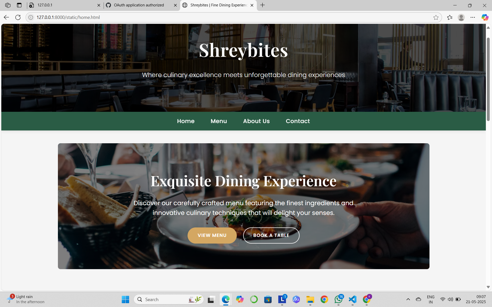
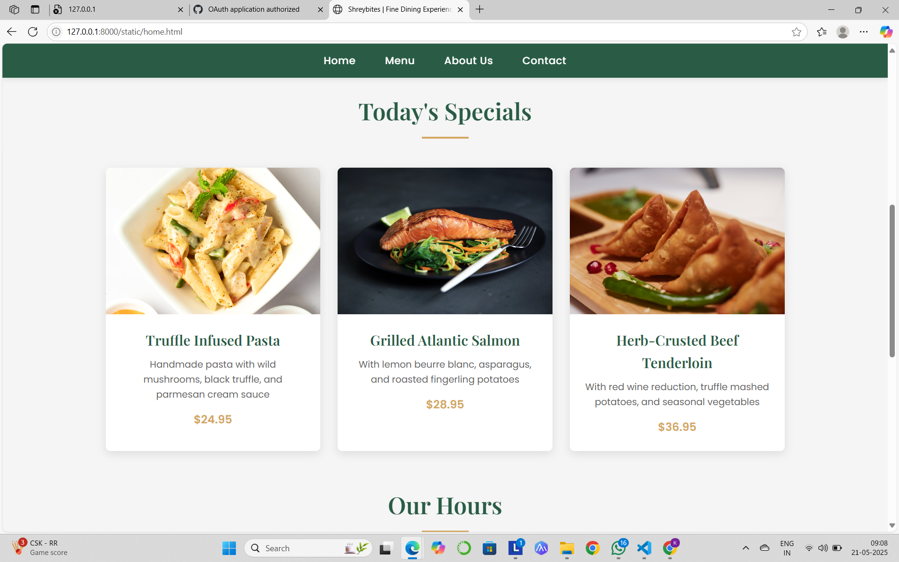
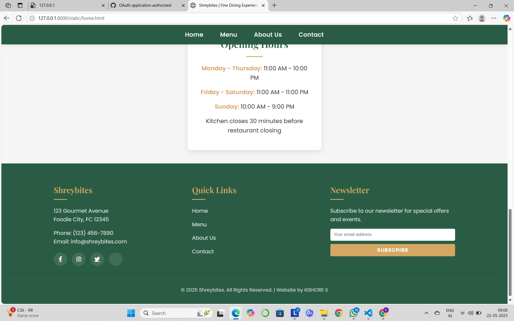
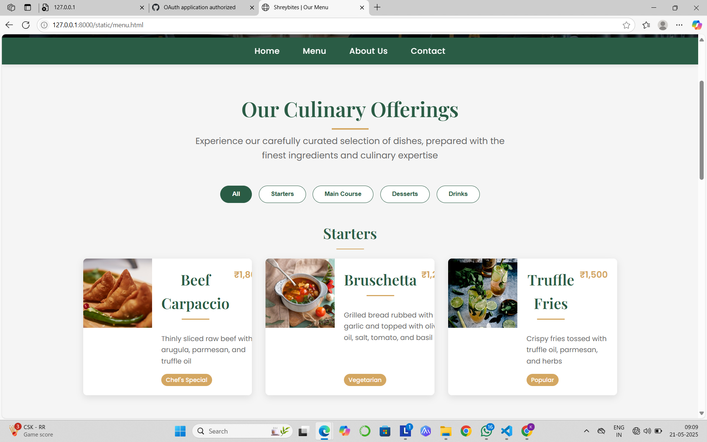
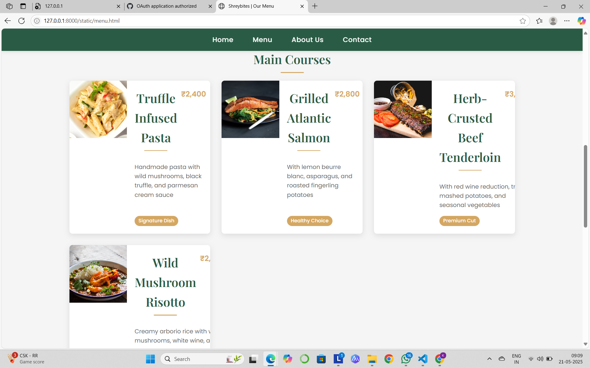
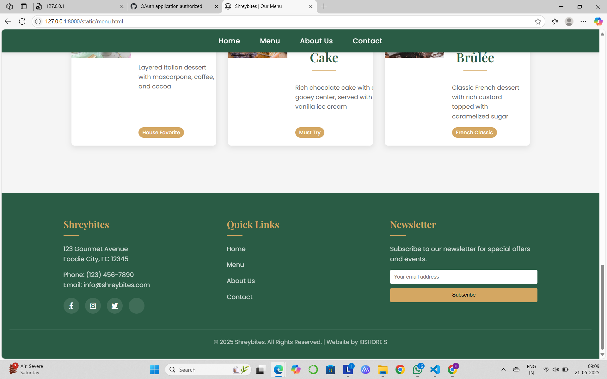
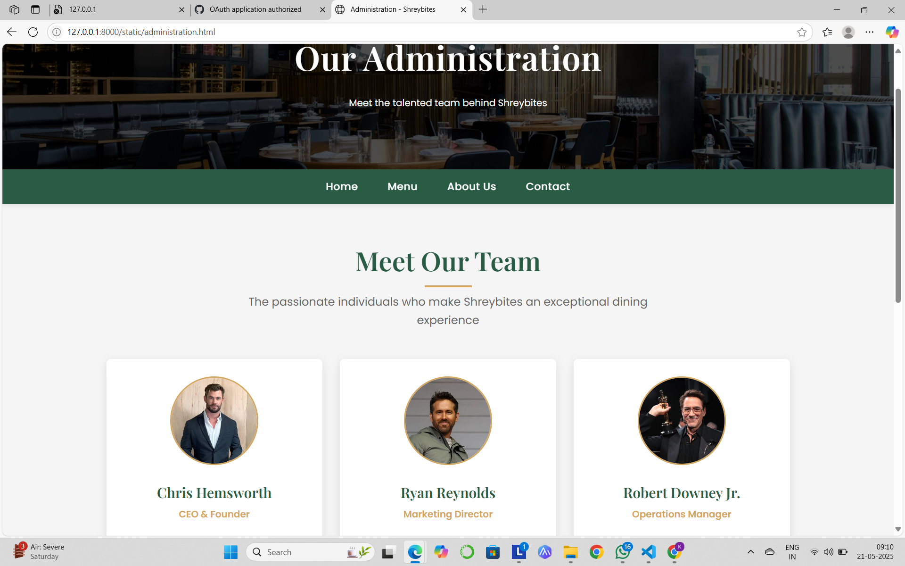
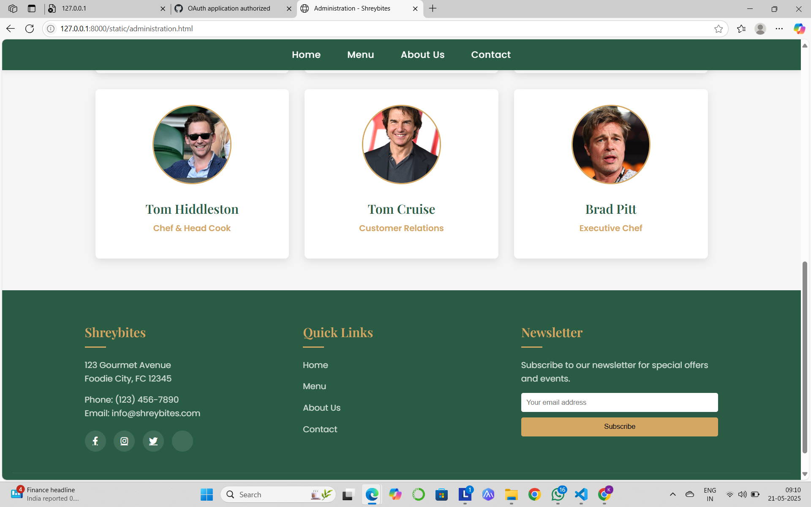
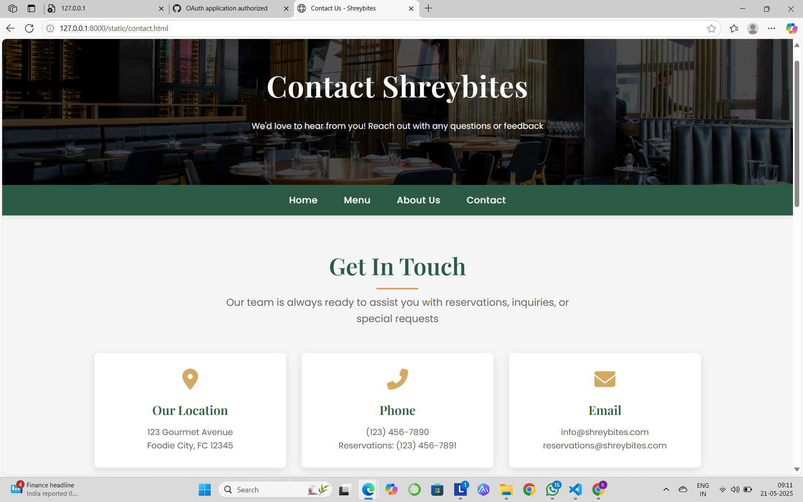
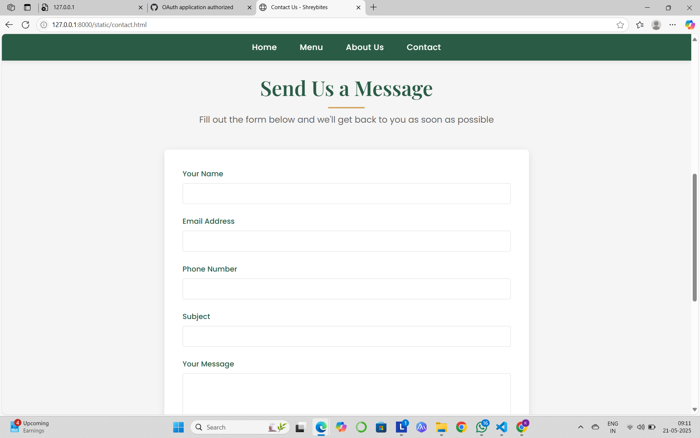
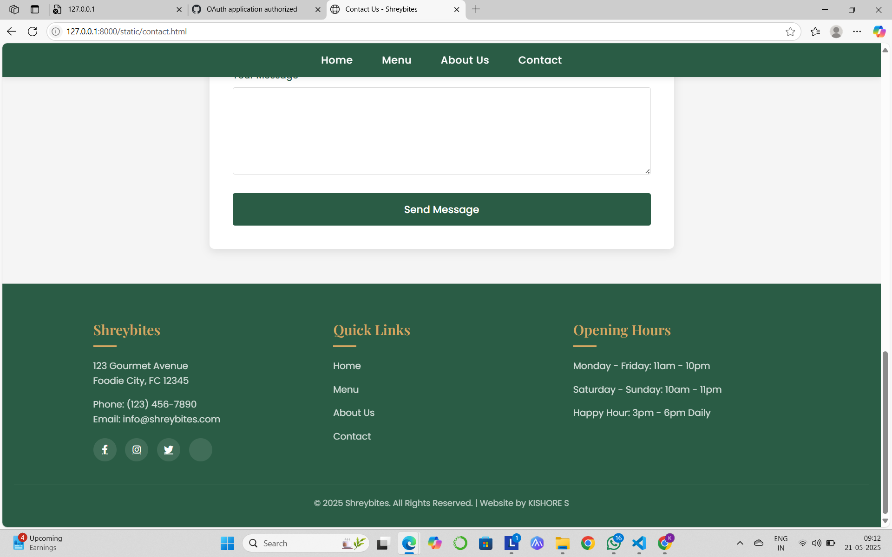

## RESULT:
The program for designing software company website using HTML and CSS is completed successfully.
